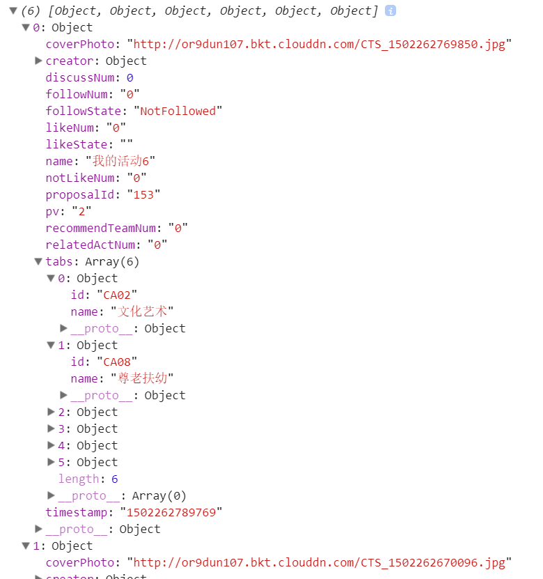
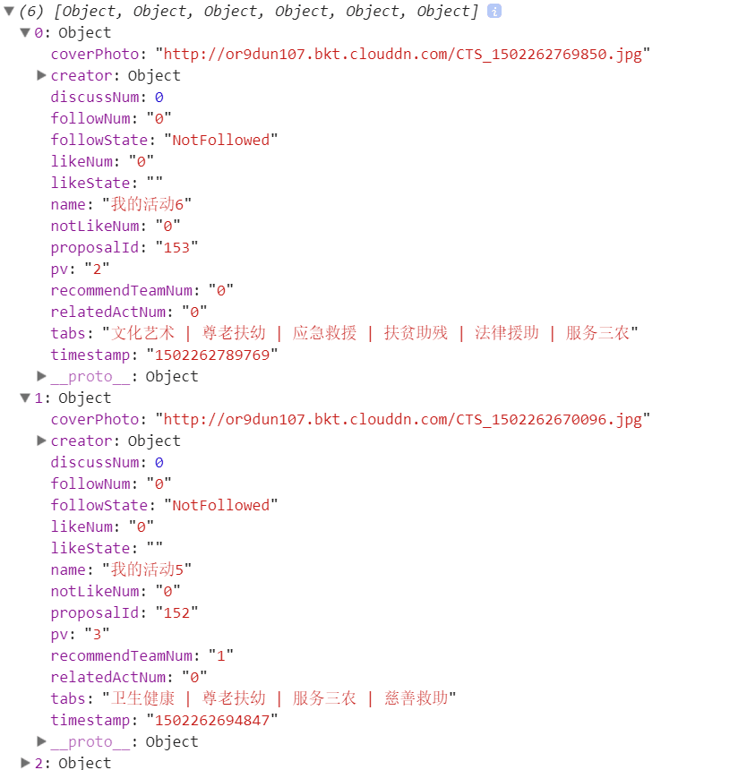

# WeChat_public
## 面向对象思想转换数据结构
### 后台传过来的数据结构

### 转换后的数据结构

## 二进制流上传图片
        //上传图片
        $("li").on("click", function () {
            var index = $(this).index();
            //console.log(index);
            $(".file").eq(index).on("change", function () {
                // 获取第一个文件信息
                $(this).siblings(".img").css({"zIndex":"7"});

                var fileData = this.files[0];
                //console.log(fileData);

                //读取图片数据 base64

                var reader = new FileReader();
                reader.readAsDataURL(fileData);
                reader.onload = function (e) {
                    var data = e.target.result;
                    //加载图片获取图片真实宽度和高度
                    var image = new Image();
                    image.onload=function(){
                        var width = image.width;
                        var height = image.height;
                        //console.log(width);
                        //console.log(height);
                    };
                    image.src= data;
                    $("#editable li:eq("+(index)+")").find(".img").attr("src",this.result);
                    //base64去掉前缀
                    //var datas = data.substring(data.indexOf(",") + 1)
                    //base64转二进制blob
                    //function dataURItoBlob(dataURI) {
                    //    var byteString = atob(dataURI.split(',')[1]);
                    //    var mimeString = dataURI.split(',')[0].split(':')[1].split(';')[0];
                    //    var ab = new ArrayBuffer(byteString.length);
                    //    var ia = new Uint8Array(ab);
                    //    for (var i = 0; i < byteString.length; i++) {
                    //        ia[i] = byteString.charCodeAt(i);
                    //    }
                    //    return new Blob([ab], {type: mimeString});
                    //}
                    //var fd = new FormData();
                    ////console.log(fd);
                    //var blobs = dataURItoBlob(data);
                    ////console.log(blobs);
                    //fd.append("imagesFile", blobs);
                    //append方法添加的进去的 要用特殊的get方式才能读取到
                    //console.log(fd.get("imagesFile"));
                    var formdata = new FormData();
                    formdata.append("file", fileData)
                    //console.log(formdata.get("file"));
                    $.ajax({
                        url:urls.commonUpload,
                        data:formdata,
                        type:"post",
                        processData: false, // 不会将 data 参数序列化字符串 必不可少
                        contentType: false, // 必不可少
                        success: function (data) {
                            //console.log(data);
                            $("#editable li:eq("+(index)+")").find(".img").attr("src",data.data[0]);
                        }
                    })
                };
            })
        })
